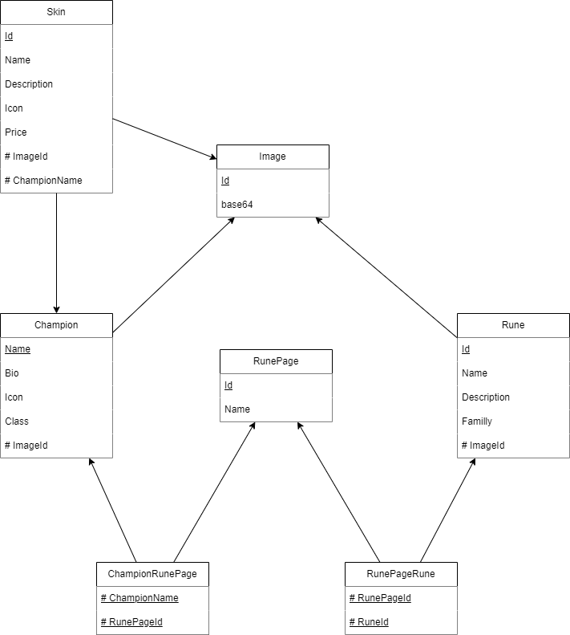
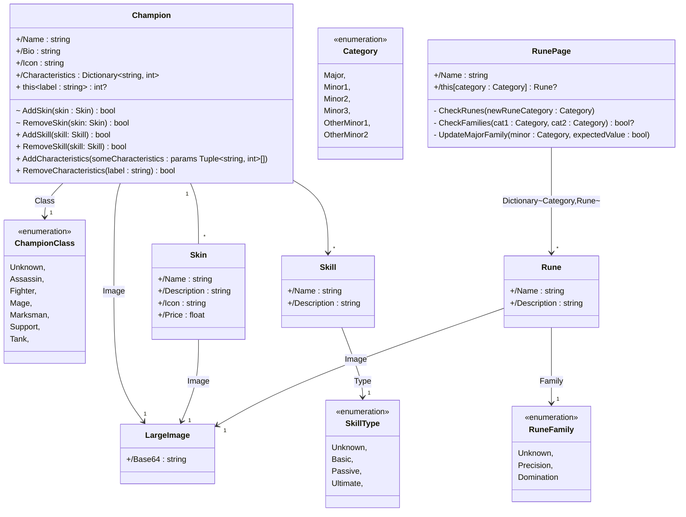
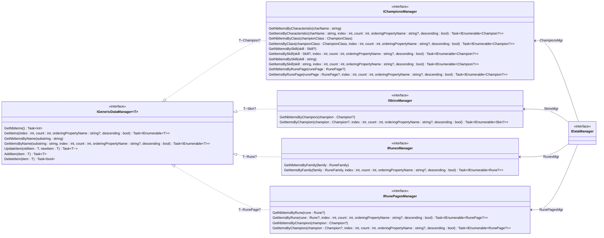
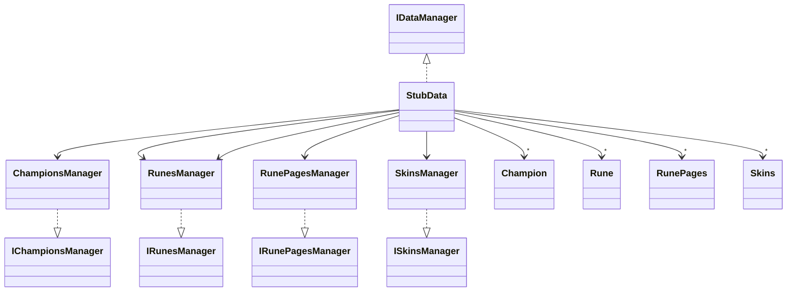

# League of Legend

Notre projet est un application MAUI développer en C# Utilisant une WebAPI et une base de données Entity Framework
Vous trouverez une explication de l'architecture de notre projet dans le fichier `Schéma_architecture` dans le dossier `Assets`

## Installation du projet

- Clonez le dépot à l'aide de la commande `git clone https://codefirst.iut.uca.fr/git/hugo.livet/lol.git`
- Ouvrez le projet dans Visual Studio
- Restaurez les packages NuGet en utilisant la commande `dotnet restore` dans le terminal ou en utilisant l'interface graphique de Visual Studio
- Compilez le projet en utilisant la commande `dotnet build` ou en utilisant l'interface graphique de Visual Studio

## Web API

Executez notre Web API avec la branche `master` sélectionnée.

### Informations :

Nos entités sont identifiées par leur nom.
Nous avons pris le choix de séparer l'image et le champion pour gagner en performance. Nous appellons l'image que lorsque nous en avons besoin.

L'API fournit les routes suivants :
La differance entre la V1 et la V2 est le nombre de routes et la pagination n'est pas présente dans la V1

Gestion des Champions (V1) : 
- `/api/v1/Champions` (GET) : Récupération de tous les champions
- `/api/v1/Champions/{nom}` (GET) : Récupération d'un champion grâce à son nom
- `/api/v1/Champions` (POST) : Ajout d'un champion
- `/api/v1/Champions/{nom}` (PUT) : Modification d'un champion grâce à son nom
- `/api/v1/Champions/{nom}` (DELETE) : Suppression d'un champion grâce à son nom

Gestion des Champions (V2) : 
- `/api/v2/Champions` (GET) : Récupération de tous les champions
- `/api/v2/Champions/{nom}` (GET) : Récupération d'un champion grâce à son nom
- `/api/v2/Champions/{nom}/image` (GET) : Récupération de l'image d'un champion grâce au nom du chapion
- `/api/v2/Champions/{nom}/skins` (GET) : Récupération des skins d'un champion grâce au nom du champion
- `/api/v2/Champions` (POST) : Ajout d'un champion
- `/api/v2/Champions/{nom}` (PUT) : Modification d'un champion grâce à son nom
- `/api/v2/Champions/{nom}` (DELETE) : Suppression d'un champion grâce à son nom

Gestion des Skins (V2) :
- `/api/v2/Skins` (GET) : Récupération de tous les skins
- `/api/v2/Skins/{nom}` (GET) : Récupération d'un skin grâce à son nom
- `/api/v2/Skins/{nom}/image` (GET) : Récupération de l'image d'un skin grâce au nom du chapion
- `/api/v2/Skins` (POST) : Ajout d'un skin
- `/api/v2/Skins/{nom}` (PUT) : Modification d'un skin grâce à son nom
- `/api/v2/Skins/{nom}` (DELETE) : Suppression d'un skin grâce à son nom

## Entity Framework

Nos entités sont identifiées par leur nom.
Nous avons pris le choix de séparer l'image et le champion pour gagner en performance. Nous appellons l'image que lorsque nous en avons besoin.

Entités présentes dans notre base de données :
- Champions 
- Skins
- Runes
- RunePages
- Images

Dans notre base de données, nous disposons de plusieurs relations. Tout d'abord, un champion dispose de plusieurs skin et un skin est lié qu'à un et un seul champion. 
Ensuite il existe une relation entre champion, rune et runePage. Un champion possède une liste de RunePages et une RunePage peut être possédée par plusieurs champions. 
De plus une Rune est présente dans plusieurs RunePage et une RunePage dispose de plusieurs Rune. 

Voici un Modèle Logique de notre base.

 
      

## Diagramme de classes du modèle

## Diagramme de classes des interfaces de gestion de l'accès aux données

## Diagramme de classes simplifié du Stub
